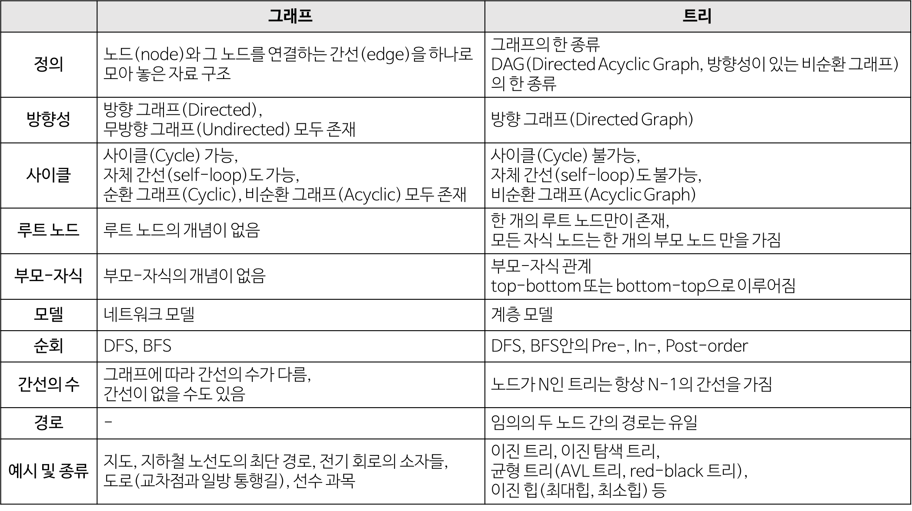

### 그래프란?

- 단순히 노드(N, node)와 그 노드를 연결하는 간선(E, edge)을 하나로 모아 놓은 자료 구조
  - 즉, 연결되어 있는 객체 간의 관계를 표현할 수 있는 자료 구조이다.
  Ex) 지도, 지하철 노선도의 최단 경로, 전기 회로의 소자들, 도로(교차점과 일방 통행길), 선수 과목 등
  - 그래프는 여러 개의 고립된 부분 그래프(Isolated Subgraphs)로 구성될 수 있다

#### 그래프와 트리의 차이


#### 그래프 관련 용어

````
- 정점(vertex): 위치라는 개념. (node 라고도 부름)
- 간선(edge): 위치 간의 관계. 즉, 노드를 연결하는 선 (link, branch 라고도 부름)
- 인접 정점(adjacent vertex): 간선에 의 해 직접 연결된 정점
- 정점의 차수(degree): 무방향 그래프에서 하나의 정점에 인접한 정점의 수
- 무방향 그래프에 존재하는 정점의 모든 차수의 합 = 그래프의 간선 수의 2배
- 진입 차수(in-degree): 방향 그래프에서 외부에서 오는 간선의 수 (내차수 라고도 부름)
- 진출 차수(out-degree): 방향 그래픙에서 외부로 향하는 간선의 수 (외차수 라고도 부름)
- 방향 그래프에 있는 정점의 진입 차수 또는 진출 차수의 합 = 방향 그래프의 간선의 수(내차수 + 외차수)
- 경로 길이(path length): 경로를 구성하는 데 사용된 간선의 수
- 단순 경로(simple path): 경로 중에서 반복되는 정점이 없는 경우
- 사이클(cycle): 단순 경로의 시작 정점과 종료 정점이 동일한 경우
````

#### 그래프의 특징
- 그래프는 네트워크 모델 이다.
- 2개 이상의 경로가 가능하다.
- 즉, 노드들 사이에 무방향/방향에서 양방향 경로를 가질 수 있다.
- self-loop 뿐 아니라 loop/circuit 모두 가능하다.
- 루트 노드라는 개념이 없다.
- 부모-자식 관계라는 개념이 없다.
- 순회는 DFS나 BFS로 이루어진다.
- 그래프는 순환(Cyclic) 혹은 비순환(Acyclic)이다.
- 그래프는 크게 방향 그래프와 무방향 그래프가 있다.
- 간선의 유무는 그래프에 따라 다르다.


#### 무방향 그래프 VS 방향 그래프
- 무방향 그래프(Undirected Graph)
  - 무방향 그래프의 간선은 간선을 통해서 양 방향으로 갈 수 있다.
  - 정점 A와 정점 B를 연결하는 간선은 (A, B)와 같이 정점의 쌍으로 표현한다.
  - (A, B)는 (B, A) 동일
  - Ex) 양방향 통행 도로
- 방향 그래프(Directed Graph)
  - 간선에 방향성이 존재하는 그래프
  - A -> B로만 갈 수 있는 간선은 <A, B>로 표시한다.
  - <A, B>는 <B, A>는 다름


#### 그래프의 구현 
- 인접 리스트(Adjacency List)로 그래프를 표현하는 것이 가장 일반적인 방법 이다.
- 모든 정점(혹은 노드)을 인접 리스트에 저장한다. 즉, 각각의 정점에 인접한 정점들을 리스트로 표시한 것이다.
  - 배열(혹은 해시테이블)과 배열의 각 인덱스마다 존재하는 또 다른 리스트(배열, 동적 가변 크기 배열(ArrayList), 연결리스트(LinkedList) 등)를 이용해서 인접 리스트를 표현
  - 정점의 번호만 알면 이 번호를 배열의 인덱스로 하여 각 정점의 리스트에 쉽게 접근할 수 있다.
  
- 무방향 그래프(Undirected Graph)에서 (a, b) 간선은 두 번 저장된다.
  - 한 번은 a 정점에 인접한 간선을 저장하고 다른 한 번은 b에 인접한 간선을 저장한다.
  - 정점의 수: N, 간선의 수: E인 무방향 그래프의 경우
  - N개의 리스트, N개의 배열, 2E개의 노드가 필요
```
0: 1
1: 2
2: 0, 3
3: 2
4: 6
5: 4
6: 5
```
- 인접행렬을 이용한 표현
  - 인접 행렬은 NxN 불린 행렬(Boolean Matrix)로써 matrix[i][j]가 true라면 i -> j로의 간선이 있다는 뜻이다.
- 정점(노드)의 개수가 N인 그래프를 인접 행렬로 표현
  - 간선의 수와 무관하게 항상 n^2개의 메모리 공간이 필요하다.
- 무방향 그래프를 인접 행렬로 표현한다면 이 행렬은 대칭 행렬(Symmetric Matrix)이 된다.
  - 물론 방향 그래프는 대칭 행렬이 안 될 수도 있다.
- 인접 리스트를 사용한 그래프 알고리즘들(Ex. 너비 우선 탐색) 또한 인접 행렬에서도 사용이 가능하다.
  - 하지만 인접 행렬은 조금 효율성이 떨어진다.
  - 인접 리스트는 어떤 노드에 인접한 노드들을 쉽게 찾을 수 있지만 인접 행렬에서는 인접한 노드를 찾기 위해서는 모든 노드를 전부 순회해야 한다
 

#### 인접리스트와 인접행렬중 선택

````
인접 리스트
그래프 내에 적은 숫자의 간선만을 가지는 희소 그래프(Sparse Graph) 의 경우

장점
어떤 노드에 인접한 노드들 을 쉽게 찾을 수 있다.
그래프에 존재하는 모든 간선의 수 는 O(N+E) 안에 알 수 있다. : 인접 리스트 전체를 조사한다.

단점
간선의 존재 여부와 정점의 차수: 정점 i의 리스트에 있는 노드의 수 즉, 정점 차수만큼의 시간이 필요

````

````
인접 행렬
그래프에 간선이 많이 존재하는 밀집 그래프(Dense Graph) 의 경우

장점
두 정점을 연결하는 간선의 존재 여부 (M[i][j])를 O(1) 안에 즉시 알 수 있다.
정점의 차수 는 O(N) 안에 알 수 있다. : 인접 배열의 i번 째 행 또는 열을 모두 더한다.

단점
어떤 노드에 인접한 노드들을 찾기 위해서는 모든 노드를 전부 순회해야 한다.
그래프에 존재하는 모든 간선의 수는 O(N^2) 안에 알 수 있다. : 인접 행렬 전체를 조사한다.
````


### 그래프의 탐색
- DFS , BFS 

[출처](https://gmlwjd9405.github.io/2018/08/13/data-structure-graph.html) 