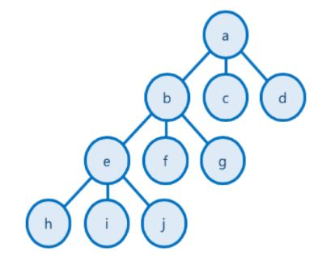

# JavaAndAlgorithms

## 7주차 문제(3/7 ~ 3/11)
3/7, 백준 알고리즘 : [3085번 사탕 게임](https://www.acmicpc.net/problem/3085) </br>
3/8, 백준 알고리즘 : [1182번 부분수열의 합](https://www.acmicpc.net/problem/1182) </br>
3/9, 백준 알고리즘 : [2503번 숫자야구](https://www.acmicpc.net/problem/2503) </br>
3/10, 백준 알고리즘 : [2178 미로탐색](https://www.acmicpc.net/problem/2178) </br>
3/11, 백준 알고리즘 : [1759번 암호 만들기](https://www.acmicpc.net/problem/1759) </br>
---

### 백트래킹이란?
```
- 퇴각 검색 (Backtrack)으로 불린다.
- 해를 찾기 위해, 후보군에 제약 조건을 점진적으로 체크하다가,
  해당 후보군이 제약 조건을 만족할 수 없다고 판단되는 즉시 backtrack (다시는 이 후보를 체크하지 않을 것을 표기)하고, 
  바로 다른 후보로 넘어가며, 결국 최적의 해를 찾는 방법
- 고려할 수 있는 모든 경우의 수 (후보)를 상태공간트리(State Space Tree)를 통해 표현
  각 후보를 DFS 방식으로 확인
  상태 공간 트리를 탐색하면서, 제약이 맞지 않으면 해의 후보가 될만한 곳으로 바로 넘어가서 탐색
```
#### 상태 공간 트리
```
- 문제 해결 과정의 중간 상태를 각각의 노드로 나타낸 트리
- 예를들어 a를 시작으로 각 높이의 1개 노드를 연결해 연속 4개를 홀수를 만들고 싶다고 가정하자. a - b - e - h가 전부 홀수라면 가능한 경우이다.
  그런데 만약 b가 홀수가 아니라면 이미 a - b 다음에 뭐가 오더라도 조건을 만족하지 못하기 때문에 b 아래는 조사하지 않고 Backtracking 한다는 것이다. 
```

