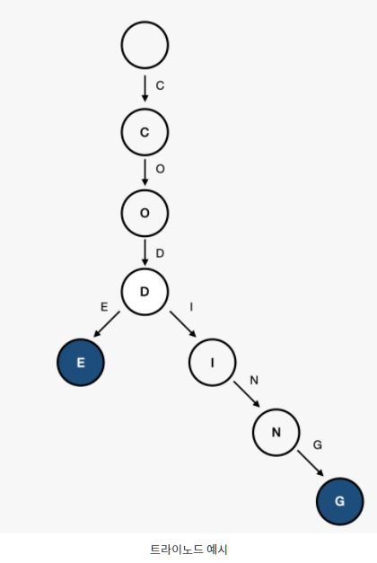

### 트라이 자료구조란
```
트라이(Trie)란 문자열을 저장하고 효율적으로 탐색하기 위한 트리 형태의 자료구조입니다.
목적
사용하는 이유는 문자열의 탐색을 하고자할 때 시간복잡도를 보면 알 수 있습니다. 
단순하게 하나씩 비교하면서 탐색을 하는것보다 훨씬 효율적입니다. 
단, 빠르게 탐색이 가능하다는 장점이 있지만 각 노드에서 자식들에 대한 포인터들을 배열로 모두 저장하고 있다는 점에서 저장 공간의 크기가 크다는 단점도 있습니다.
검색어 자동완성, 사전에서 찾기 그리고 문자열 검사 같은 부분에서 사용할 수 있다고 첨부된 자료에 나와있습니다. 
 
해당 문제에서는
맨위에 루트 TrieNode는 자식 노드 맵 Map<Character, TrieNode>과 현재 노드가 마지막 글자인지 여부에 대한 isLastChar 정보를 가지고있다.

```
````

Java 8 Map에서 빈번하게 사용되는 코드패턴

<예제>
Map<Key,Value> map = new HashMap<>();
Value value = map.get(key);
if(value == null){
    value = getNewValue(key);
    map.put(key,value);
}
Map 에서 특정 키에 해당하는 값이 존재한지 확인한후, 없으면 새롭게 만들어서 넣어주는 형태의 코드이다.

Key값에 해당하는 Value가 존재하면 가져와서 그대로 사용하고, 없으면 새로 만들어주는 패턴의 코드는
java 8 에서 computeIfAbsent() 메소드를 사용하여 구현할 수 있다.

computeIfAbsent : key값에 해당하는 Value가 존재하면 가져와서 사용하고 없으면 새로 만들어주는 패턴

<예제>
Map<Key,Value> map = new HashMap<>();
Value value = map.computeIfAbsent(key, k -> getNewValue(key));
``````

